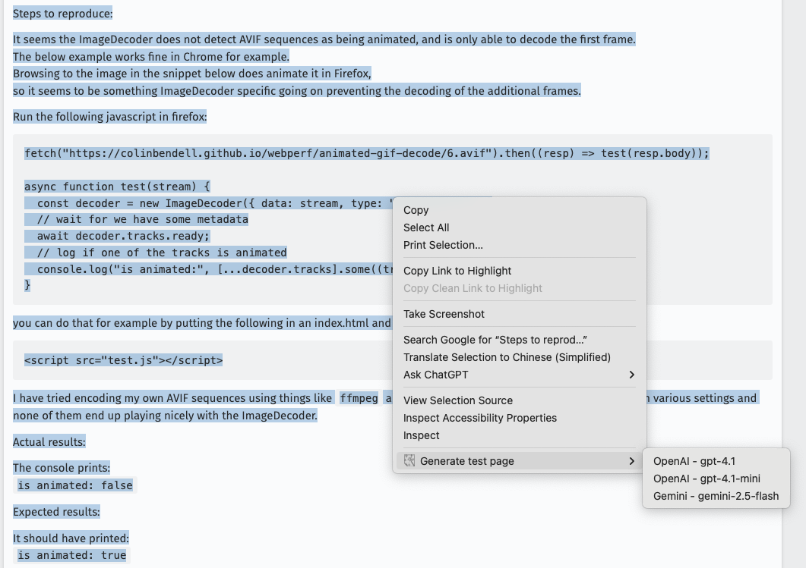
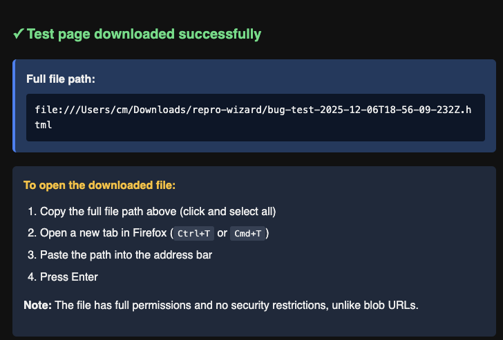

# Repro Wizard

A Firefox extension that generates minimal HTML test pages from bug reports using AI (OpenAI or Google Gemini).

## Features

- Right-click selected bug report text to generate test pages
- Multiple AI model support (OpenAI GPT-4, Gemini)
- Self-contained HTML output (vanilla JS/CSS, no dependencies)
- Automatic file download to organized folders
- Blob URL preview for immediate testing

## Installation

1. Download or clone this repository
2. Open Firefox and go to `about:debugging#/runtime/this-firefox`
3. Click "Load Temporary Add-on"
4. Select `manifest.json` from the project folder

## Setup

1. Click the extension icon or go to `about:addons` → Repro Wizard → Options
2. Add your API key(s):
   - **OpenAI**: Get from [platform.openai.com](https://platform.openai.com/api-keys)
   - **Gemini**: Get from [Google AI Studio](https://aistudio.google.com/app/apikey)
3. Configure download folder path (default: `repro-wizard`)
4. Optionally customize AI models in the options page

## Usage

1. **Select bug report text** on any webpage (from Bugzilla, GitHub Issues, etc.)
2. **Right-click** the selection
3. Choose **"Generate test page"** → Select AI model
4. Wait for generation (typically 5-15 seconds)
5. **Two tabs will open**:
   - Preview tab (blob URL) for immediate testing
      - Note: The preview tab may not run due to browser security restrictions on blob URLs
   - Info page with download file path

### Demo

*Click the image above to watch the demonstration video showing the complete workflow from initial setup through generating a test page from selected bug report text.*

### Example Input

For reference, [BMO 1998690](https://bugzilla.mozilla.org/show_bug.cgi?id=1998690#c0) demonstrates an ideal bug report format that includes core test code, expected behavior, and actual result.

### Opening Downloaded Files

Downloaded files are saved to `Downloads/<your-folder>/<filename>.html`

**To open the downloaded file:**
1. Copy the full file path from the info page
2. Open a new tab (`Ctrl+T` / `Cmd+T`)
3. Paste the path into the address bar
4. Press Enter

## Configuration

### Download Folder

Files are saved to a subfolder within Firefox's Downloads folder. Configure in Options:
- Default: `repro-wizard`
- Examples: `bug-tests/firefox`, `debug/2025`
- Leave empty to save directly in Downloads folder

### AI Models

Configure multiple models in Options. Each appears as a submenu item:
- **Menu label**: Display name in context menu
- **Model ID**: API model identifier (e.g., `gpt-4o-mini`, `gemini-2.5-flash`)
- **Provider**: OpenAI or Google Gemini

### System Prompt

The extension instructs AI to generate:
- Single self-contained HTML file
- Vanilla HTML/CSS/JS only
- Button-triggered test with on-page results
- Minimal design without fancy features
- Clear variable names over excessive comments

## Troubleshooting

### Context menu not appearing
1. Reload the extension at `about:debugging`
2. Select text and try again
3. Check browser console for errors

### Download issues
- Verify download folder path in Options
- Check Firefox Downloads folder permissions
- Review browser console for download errors

### API errors
- Verify API key is correct and active
- Check API quota/billing status
- Ensure network connectivity

### Generated files incomplete
- Token limit is 8000 - complex bugs may need manual editing
- Try a different AI model
- Simplify the bug report text before generating

## Privacy & Security

- API keys stored locally in Firefox sync storage
- Bug reports sent directly to chosen AI provider
- No data collection by this extension
- Generated files downloaded to local disk only

## Requirements

- Firefox 109.0 or higher
- Active OpenAI or Gemini API key
- Internet connection for AI generation

## TODOS
- Allow users to customize and modify system prompts
- Support different preset prompts for various bug components and modules

## License

MIT License - See LICENSE file for details
